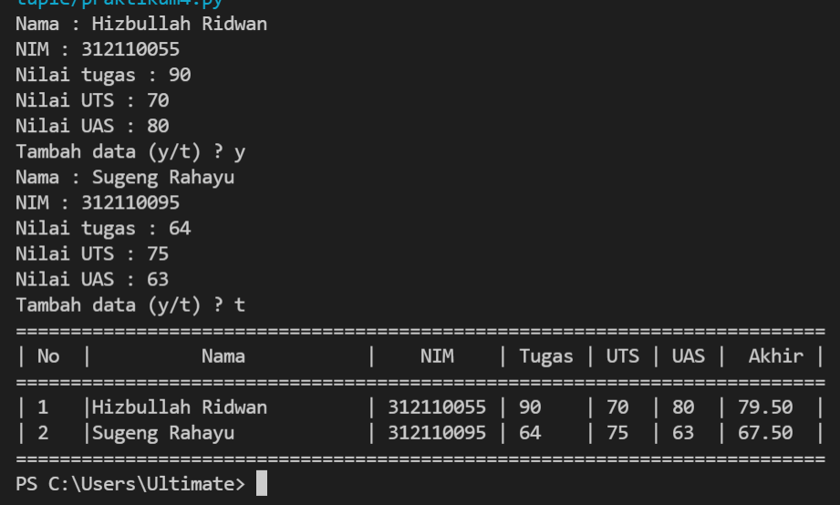

# Latihan membuat list python  

* Nama          : Hizbullah Ridwan
* NIM           : 312110055
* Kelas         : TI.21.C.1
* Mata Kuliah   : Bahasa Pemrograman
----------------------------------
Dalam latihan membuat conditional dan loop [python](https://www.python.org/) ini, saya menggunakan [visual studio code](https://code.visualstudio.com/) sebagai teks editornya.     
    

* [Latihan](https://github.com/Ridwanwildan/List-Python#latihan)         
* [Tugas](https://github.com/Ridwanwildan/List-Python#tugas)      
  

## Latihan      

```bash
# Ada list yang memiliki 5 elemen
a = [10, 20, 30, 40, 50]

# Tampilkan elemen ke 3
print(a[2])

# Ambil nilai elemen ke 2 sampai ke 4
a[1:4]

# Ambil elemen terakhir
a[4]

# Ubah elemen ke 4 dengan nilai lainnya
a[3] = 4444

# Ubah elemen ke 4 sampai dengan elemen terakhir
a[3:] = [3000, 4000]

# Ambil 2 bagian dari list pertama (a) dan jadikan list kedua (b)
b = a[0:2]

# Tambah list B dengan nilai string
b.append("Hizbullah")

# Tambah list B dengan 3 nilai
b.extend([66, 77, 88])

# Gabungkan list B dengan list A
c = a + b

```    

Program ini merupakan latihan cara membuat list, menampilkan elemen yang ada didalam list, mengubah, dan menggabungkannya. Untuk membuat list dan membuat elemen didalamnya, maka seperti ini :       

> a = [10, 20, 30, 40, 50]      
> ------------------------         
> output = [10, 20, 30, 40, 50]       

Angka 10 berada di **index ke-0** dan **elemen ke-1**, Angka 20 berada di **index ke-1** dan **elemen ke-2** dan seterusnya berurutan. Untuk mengakses nilai tertentu didalam sebuah list maka kita harus gunakan nomor indexnya. contohnya seperti ini :         

> a[2]      
> --------------                
> output = [30]       

Kita baru saja coba mengakses index ke-2 dari elemen list dan yang muncul adalah angka 30 yang merupakan elemen ke-3 dari list yang kita punya.     

## Tugas     

```bash
nama = []
nim = []
tugas = []
uts = []
uas = []
ulang = "y"

while ulang == "y":
 nama.append(input("Nama : "))
 nim.append(input("NIM : "))
 tugas.append(int(input("Nilai tugas : ")))
 uts.append(int(input("Nilai UTS : ")))
 uas.append(int(input("Nilai UAS : ")))
 ulang = input("Tambah data (y/t) ? ")

print("==========================================================================")
print("| No  |          Nama           |    NIM    | Tugas | UTS | UAS |  Akhir |")
print("==========================================================================")

for i in range(len(nama)):
 print("|", i+1, "  |", end="")
 print('{0:<25}'.format(nama[i]), end="")
 print("|", nim[i], end="")
 print(" |", tugas[i], end="")
 print("    |", uts[i], end="")
 print("  |", uas[i], " | ", end="")
 print(f'{(tugas[i]*30/100) + (uts[i]*35/100) + (uas[i]*35/100) :.2f}', " |")
print("==========================================================================")

```           
      

Dalam program ini, pertama kita akan mendekalarasikan list yang kosong. yaitu **nama, nim, tugas, uts, uas** dan nanti akan kita input satu persatu       

